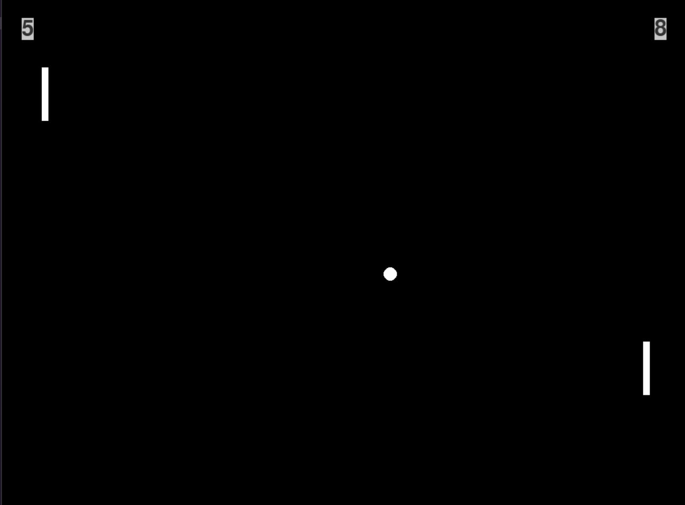

# Pong

This is my take on Pong written in pygame

## How to run the project

require Python3, pygame library

```
pip install pygame
py game.py
```
##
- W/S: move player 1's paddle up/down
- Left/Right arrow: move player 2's paddle up/down

## Demo

</img>

<a href="https://github.com/hoangdesu">Instructor: @hoangdesu</a>

